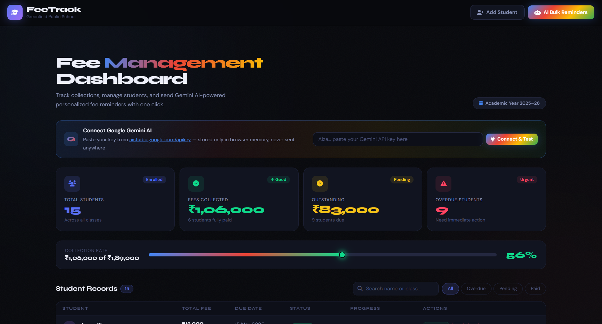
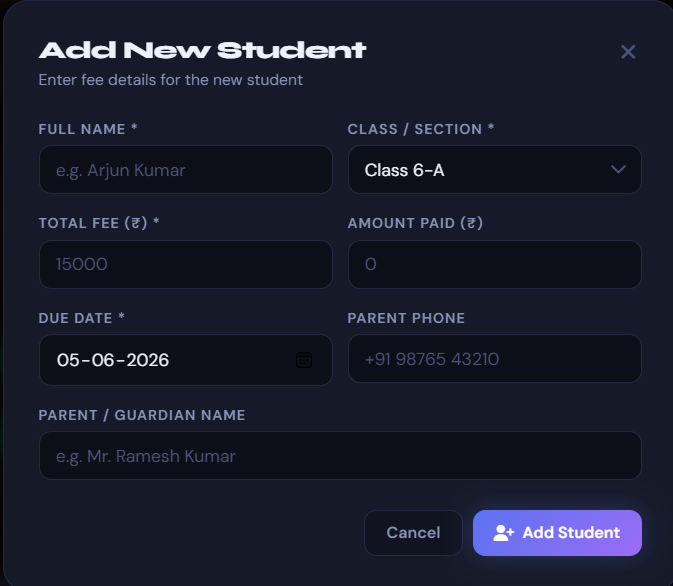
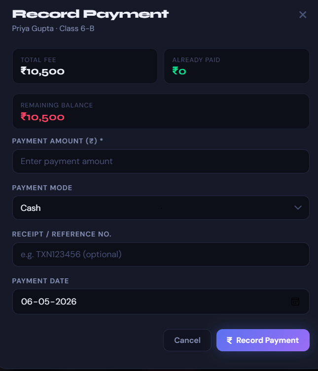
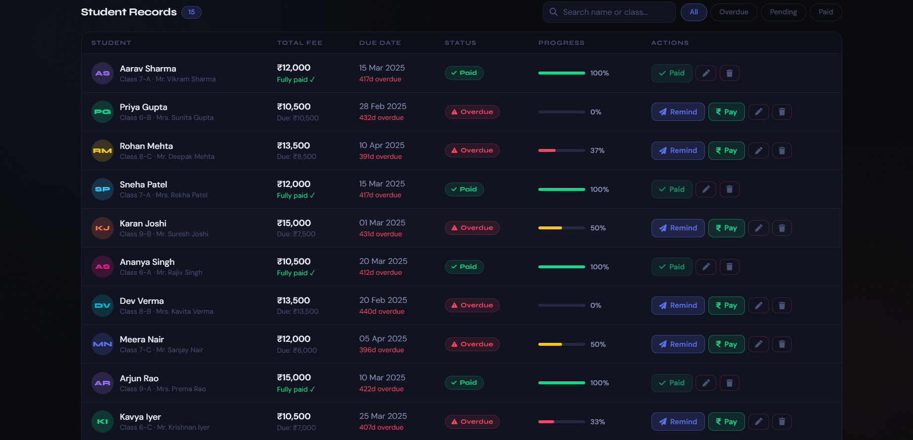
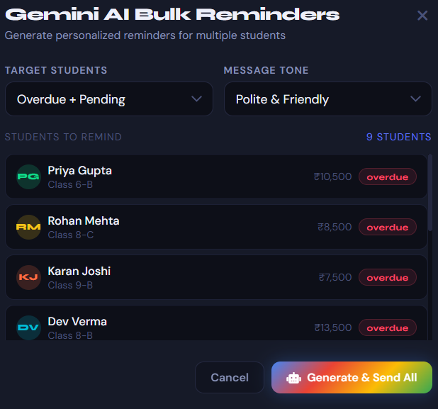

<div align="center">


<br/>

[](https://abhayraj0304-dotcom.github.io/Fee-Reminder/)
[](https://github.com/abhayraj0304-dotcom/Fee-Reminder)

<br/>

[](https://developer.mozilla.org/en-US/docs/Web/HTML)
[](https://developer.mozilla.org/en-US/docs/Web/CSS)
[](https://developer.mozilla.org/en-US/docs/Web/JavaScript)
[](https://ai.google.dev/)
[](/)
[](LICENSE)

<br/>

> 🎓 **FeeTrack** is a sleek, dark-themed, single-file school fee management dashboard built for **Greenfield Public School**.
> It combines real-time student fee tracking with **Google Gemini AI** to auto-generate personalized WhatsApp-ready reminder messages —
> all with **zero backend, zero database, zero install.**

<br/>

</div>

---

## 📸 Screenshots

<div align="center">

| 🏠 Dashboard | 👤 Add Student |
|:---:|:---:|
|  |  |

| 💳 Record Payment | 📋 Student Records |
|:---:|:---:|
|  |  |

| 🤖 AI Bulk Reminders |
|:---:|
|  |

</div>

---

## 🎯 The Real Problem This Solves

<div align="center">

> ### *"Fees track karna manually — Excel mein, register mein, WhatsApp pe — ek headache hai."*
> *("Tracking fees manually — in Excel, registers, WhatsApp — is a nightmare.")*

</div>

School fee management in India is still largely done manually:

<div align="center">

| Problem | Impact |
|:-------:|:------:|
| 📋 Paper registers & Excel sheets | Data scattered, error-prone |
| 📞 Manual calls & messages for reminders | Time-consuming for staff |
| 🔍 No real-time overdue visibility | Late collection, revenue gaps |
| ✍️ Writing individual reminder messages | 30+ min daily just for follow-ups |

</div>

### 😔 The Staff Struggle

```
👩‍🏫 Teacher:   "Kitne bacchon ki fees pending hai?"
🗂️ Staff:      *digs through Excel, register, WhatsApp chats*
⏰ Result:     30 minutes wasted. Daily. Every school. Across India.
```

**FeeTrack solves this in one click.**

---

## 💡 The Solution — One Dashboard, Everything

<div align="center">

```
╔═══════════════════════════════════════════════════════════════╗
║                                                               ║
║   📋  Student added with fee details                         ║
║            │                                                  ║
║            ▼                                                  ║
║   📊  Live dashboard auto-updates                            ║
║            │                                                  ║
║            ▼                                                  ║
║   🔴  Overdue students flagged instantly                     ║
║            │                                                  ║
║            ▼                                                  ║
║   🤖  Gemini AI generates personalized reminder              ║
║            │                                                  ║
║            ▼                                                  ║
║   📲  Copy → Paste → Send on WhatsApp!                       ║
║                                                               ║
╚═══════════════════════════════════════════════════════════════╝
```

</div>

No Excel. No manual typing. No missed dues. **Just results.**

---

## ✨ Features

<div align="center">

| Feature | Description |
|:-------:|:------------|
| 📊 **Live Dashboard** | Total students, collected, outstanding & overdue — updated instantly |
| 👨‍🎓 **Student Management** | Add, edit, delete with full details — name, class, parent, fee, due date |
| 💳 **Payment Recording** | Record Cash / Online / Cheque / DD with receipt numbers |
| 🔍 **Smart Filters** | Filter by All · Paid · Pending · Overdue + live name/class search |
| 📈 **Collection Rate Bar** | Visual progress bar for fee collection percentage |
| 🤖 **Gemini AI Reminders** | Bulk WhatsApp-ready messages — Polite / Formal / Urgent tone |
| 🔐 **Secure API Key** | Gemini key stored only in browser memory — never sent anywhere |
| 📱 **Responsive Design** | Works on desktop, tablet & mobile |
| 🌙 **Dark Mode UI** | Eye-friendly, modern dark theme |
| ⚡ **Zero Install** | Single HTML file — just open and run |

</div>

---

## 🤖 Gemini AI Reminder — How It Works

```
Step 1 → Enter your Google Gemini API key (free at aistudio.google.com/apikey)
Step 2 → Choose target: Overdue only / Pending only / Both
Step 3 → Choose tone: 😊 Polite & Friendly | 📄 Formal & Firm | 🚨 Urgent
Step 4 → Click "Generate AI Reminder"
Step 5 → Copy the personalized message → Paste on WhatsApp Broadcast!
```

> 🔑 Your API key lives **only in browser memory** — never logged, never sent to any server except Google's own AI endpoint.

---

## 🚀 Getting Started

<div align="center">

### ▶️ Option 1 — Just Open Online (Recommended)

[](https://abhayraj0304-dotcom.github.io/Fee-Reminder/)

*No download. No account. No install. Click and go.*

</div>

### 💻 Option 2 — Run Locally

```bash
# Clone the repository
git clone https://github.com/abhayraj0304-dotcom/Fee-Reminder.git

# Navigate into the project
cd Fee-Reminder

# Open in browser — NO build step needed!
open index.html        # macOS
start index.html       # Windows
xdg-open index.html    # Linux
```

> ✅ **100% static. Zero dependencies. Zero build tools.** Just open the file.

---

## 🧪 Sample Data Included

FeeTrack ships with **15 pre-loaded students** across Classes 6–9 with realistic Indian names, fee amounts (₹10,500–₹15,000), and mixed payment statuses — so you can **explore every feature immediately** without entering test data.

---

## 🛠️ Tech Stack

```
🌐 Frontend      →   Pure HTML5 + CSS3 + Vanilla JavaScript
🤖 AI Engine     →   Google Gemini Pro via REST (/v1beta/models/gemini-pro)
🎨 Design        →   Custom CSS properties, animations, glassmorphism
🔤 Fonts         →   Google Fonts: Syne (headings) + DM Sans (body)
🖼️ Icons          →   Font Awesome v6.5
```

**Zero dependencies. Zero frameworks. Zero installs. Single HTML file.**

---

## 📁 Project Structure

```
Fee-Reminder/
│
├── 📄 index.html          ← Entire app (HTML + CSS + JS in one file)

└── 📄 README.md           ← You are here!
```

---

## 🎨 Design System

<div align="center">

| Token | Hex | Usage |
|:-----:|:---:|:-----:|
| `--accent` | `#5B72F0` | Primary actions, links |
| `--accent2` | `#9B6DF5` | Gradients, highlights |
| `--green` | `#0FD98B` | Paid / success states |
| `--yellow` | `#F5C518` | Pending / warning states |
| `--red` | `#FF4565` | Overdue / error states |
| `--bg` | `#08090D` | Page background |
| `--card` | `#111420` | Card surfaces |

</div>

---

## 📱 Device Compatibility

<div align="center">

| Device | Browser | Support |
|:------:|:-------:|:-------:|
| 💻 Desktop | Chrome / Edge / Firefox / Safari | ✅ Full support |
| 📱 Android | Chrome | ✅ Works great |
| 🍎 iPhone / iPad | Safari | ✅ Full support |
| 🖥️ School / Office PC | Any modern browser | ✅ Ideal for daily use |

</div>

---

## 🔮 Roadmap

- [ ] 📤 Export fee records to CSV / PDF
- [ ] 🔔 Browser push notifications for upcoming due dates
- [ ] 📊 Monthly collection trend charts
- [ ] 🌐 Multi-school / multi-year support
- [ ] 🔐 LocalStorage persistence across sessions
- [ ] 📲 PWA — installable as offline app
- [ ] 🌍 Hindi / regional language UI support

---

## 🤝 Contributing

Contributions, issues and feature requests are welcome!

```bash
# Fork the repo, then:
git checkout -b feature/your-feature-name
git commit -m "feat: describe your change"
git push origin feature/your-feature-name
# Open a Pull Request
```

---

## 📄 License

```
MIT License — free to use, modify, and distribute.
© 2026 FeeTrack · Built for Greenfield Public School
```

---

<div align="center">


**Built with ❤️ for school administrators · Powered by Google Gemini AI**

⭐ **Star this repo if FeeTrack saved you time today!**

[](https://github.com/abhayraj0304-dotcom/Fee-Reminder)
[](https://github.com/abhayraj0304-dotcom/Fee-Reminder)

[](https://abhayraj0304-dotcom.github.io/Fee-Reminder/)

</div>
